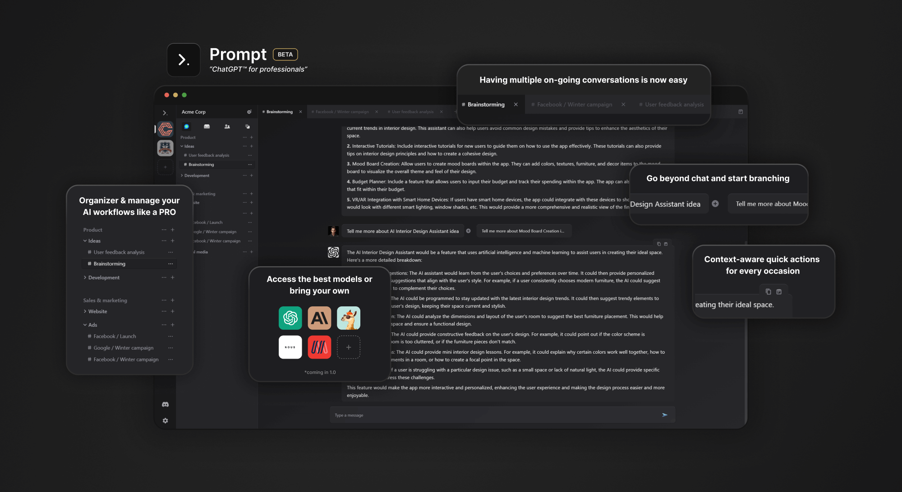

# Prompt Conductor Beta: "ChatGPT™ for professionals"

<div align="center">
  <a href="https://beta.promptc0.com" target="_blank">
    
  </a>
</div>

<div align="center">
  <a href="https://beta.promptc0.com" target="_blank">
    
  </a>
  <a href="https://discord.gg/PFMtbdrvXw" target="_blank">
    
  </a>
  <a href="https://twitter.com/promptc0" target="_blank">
    
  </a>
</div>

ChatGPT™ is fantastic but its interface is not designed for professionals with multiple on-going conversations.

This is why we built Prompt Conductor: A privacy-first multi-modal\* interface for AI-powered professionals.

Prompt is 100% open-source, decentralized*, community-driven software. Prompt has been designed as a modular platform* that anyone can extend. Modules can be anything from a new AI model to a new UI component. Module architecture is still in flux but we will be releasing more information soon.

> Conductor is Prompt's desktop user interface, designed for professionals who want to get things done using AI. Later this year, we will release Prompt's yet unnamed mobile interface, designed for individuals who want to bring AI into their everyday life. Both are built on Prompt platform, decentralized and privacy-first computing network that allows anyone to train and run AI modules.

## Key Features 🎯

🎯 Laser-focused on productivity over chitchat  
🗂️ Organize your work via workspaces, groups and folders  
🔒 Privacy-first & local-first: everything e2e encrypted  
🤖 Supports focused AI personas to improve results  
🛠️ Compatible with any model, Prompt is model-neutral  
🌐 Always 100% open-source

**\*Upcoming features 🆕**

🗣️ Talk with AIs  
🔮 Support for documents, images, audio, video and 3D  
🤝 Go multiplayer, invite others to work with you  
📱 Mobile app  
🧩 Extend almost any aspect of Prompt with user-built modules  
🌌 Prompt goes fully decentralized

## Watch Prompt in action 🎥

Coming soon 🚧

## Get started 🚀

Go to [beta.promptc0.com](https://beta.promptc0.com), create an account and you are good to go.

> Prompt is free and open-source, but you'll need OpenAI API key for the beta. Prompt's unified model engine is still in the works, so beta works directly through OpenAI's API.

Or clone this repo and run it locally:

```bash
$ git clone https://github.com/promptc0/a0
$ cd a0
$ npm install
$ npm run dev
```

## Contribute 🤝

We are looking for contributors to help us build Prompt. If you are interested, please join our [Discord](https://discord.gg/PFMtbdrvXw) and say hi!

Alternatively, follow us on [Twitter](https://twitter.com/promptc0) to stay up to date with our progress.
