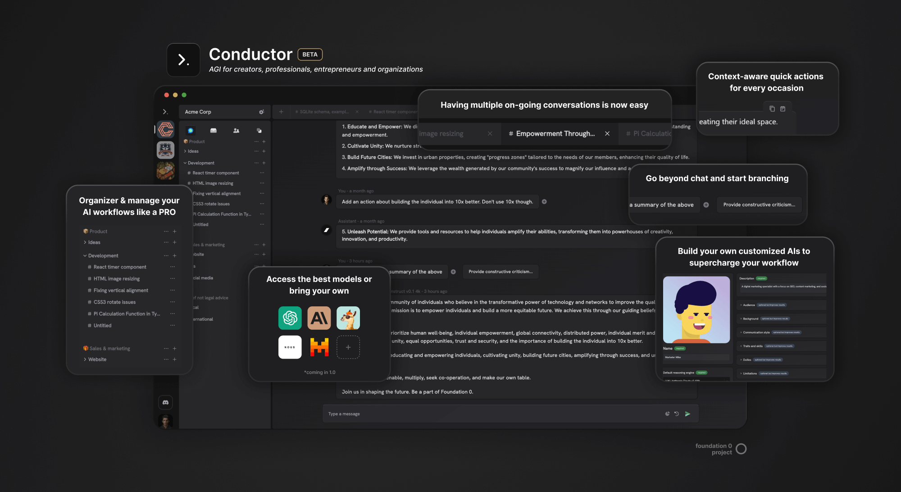

# Conductor: AGI for creators, professionals, entrepreneurs and organizations

<div align="center">
    
</div>

<div align="center">
  <a href="https://discord.gg/PFMtbdrvXw" target="_blank">
    
  </a>
  <a href="https://twitter.com/conductorc0" target="_blank">
    
  </a>
</div>

> Conductor: Multi-modal multi-tool for AI-powered creators, professionals, entrepreneurs and organizations

Conductor is open-source, decentralized*, community-driven software. Conductor has been designed as a modular platform* that anyone can extend. Modules can be anything from a new AI model to a new UI component. Module architecture is still in flux but we will be releasing more information soon.

## Key Features 🎯

🎯 Laser-focused on productivity over chitchat  
🗂️ Organize your work via workspaces, groups and folders  
🔒 Privacy-first & local-first: everything e2e encrypted  
🤖 Supports focused AI personas to improve results  
🛠️ Compatible with any model, Conductor is model-neutral  
🌐 Always 100% open-source

**\*Upcoming features 🆕**

🗣️ Talk with AIs  
🔮 Support for documents, images, audio, video and 3D  
🤝 Go multiplayer, invite others to work with you  
🧩 Extend almost any aspect of Conductor with user-built modules  
🌌 Conductor goes fully decentralized

## Watch Conductor in action 🎥

Coming soon 🚧

## Get started 🚀

> Conductor is free and open-source, but in its current beta state, it is not yet ready for production use. We are working hard to get it there as soon as possible. If you are interested in helping us test Conductor, please join our [Discord](https://discord.gg/PFMtbdrvXw) and say hi!


### Run Conductor locally
```bash
$ git clone https://github.com/foundation0/conductor
$ cd conductor
$ npm install
$ npm run build
$ npm run preview
```

Please note that as the module system is still under development, your milage running local models may vary.

## Contribute 🤝

We are looking for contributors to help us build Conductor. If you are interested, please join our [Discord](https://discord.gg/PFMtbdrvXw) and say hi!

Alternatively, follow us on [Twitter](https://twitter.com/promptc0) to stay up to date with our progress.
